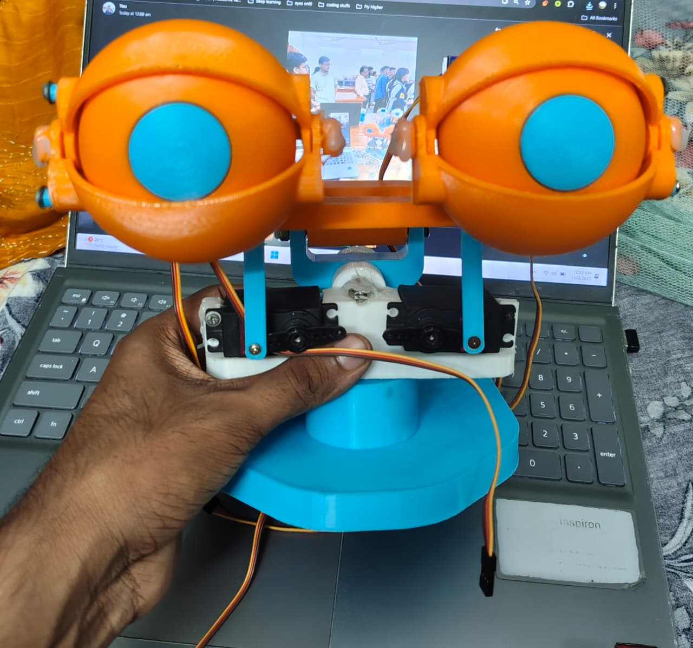
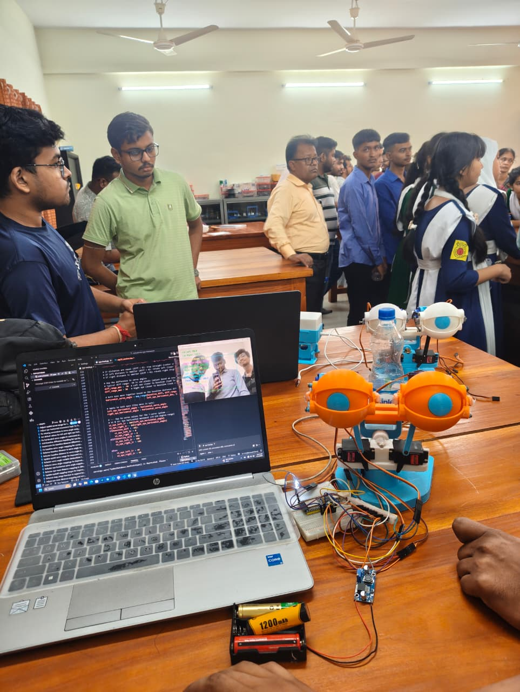

# EYEMECH ε3.2 - AI Face Tracking Animatronic Eye System
Based on Will Cogley's Eye Mechanism with Computer Vision Face Tracking

## Inspired From Will-cogley-s-EYEMECH-3.2 which had :

**Auto Mode**  


**Manual Mode**  


## My Eyemech Setup





## Overview

EYEMECH ε3.2 is an advanced face-tracking animatronic eye system that combines Will Cogley's mechanical eye design with real-time computer vision. Using MediaPipe for facial landmark detection and ESP32 for servo control, this project creates lifelike eye movements that track human faces in real-time. The system processes webcam input through Python, analyzes facial features, and controls 7 servos to replicate natural eye movements including gaze direction, eyelid motion, and head rotation.

## Features

- **Real-Time Face Tracking**: Uses MediaPipe Face Mesh to detect and track facial features with high accuracy
- **Natural Eye Movement**: Mimics human eye gaze by tracking iris position and calculating direction
- **Synchronized Eyelids**: Eyelid servos automatically adjust based on actual eye openness
- **Head Rotation Tracking**: Detects face rotation (left/right) and adjusts head servo accordingly
- **Vertical Gaze Control**: Tracks vertical eye movement by measuring iris distance from baseline
- **Horizontal Gaze Control**: Calculates left/right gaze direction from iris-to-nose distance
- **7-Servo Control System**: Complete control of both eyes, eyelids, and head rotation
- **Smooth Transitions**: Implements smoothing algorithms for realistic, non-jerky movements
- **USB Serial Communication**: Reliable data transfer from Python to ESP32
- **Visual Feedback**: Real-time overlay showing tracking points, measurements, and servo angles

## Hardware Requirements

### Computer Side (Face Tracking)
- **Computer**: Windows, macOS, or Linux with Python 3.7+
- **Webcam**: Any USB webcam or built-in camera
- **USB Cable**: For connecting to ESP32

### ESP32 Side (Servo Control)
- **ESP32 Development Board**: ESP32 WROOM or similar
- **7 Servos**:
  - 2x Eye horizontal movement servos (left and right)
  - 2x Eye vertical movement servos (left and right)
  - 2x Eyelid servos (left and right)
  - 1x Head rotation servo
- **Power Supply**: 5V-6V, sufficient for all servos (recommended 3A+)
- **Connecting Wires**: For servo connections

### Software Requirements
- **Python 3.7+** with the following packages:
  - `opencv-python` (cv2)
  - `mediapipe`
  - `pyserial`
- **Arduino IDE** (for uploading ESP32 code)
- **ESP32Servo Library** (install via Arduino Library Manager)

## Wiring Diagram

```text
ESP32 Servo Connections:
------------------------
GPIO 13  ------->  Left Eyelid Servo (S1)
GPIO 12  ------->  Right Eyelid Servo (S2)
GPIO 14  ------->  Left Eye Vertical Servo (S3)
GPIO 27  ------->  Right Eye Vertical Servo (S4)
GPIO 26  ------->  Left Eye Horizontal Servo (S5)
GPIO 25  ------->  Right Eye Horizontal Servo (S6)
GPIO 33  ------->  Head Rotation Servo (S7)
GPIO 23  ------->  Status LED (optional)

Power Connections:
------------------
5V/6V External Power Supply  --->  All Servo Power Lines (Red wires)
GND (Common Ground)          --->  ESP32 GND + All Servo Ground Lines (Brown/Black wires)

USB Connection:
---------------
ESP32 USB Port  <----------->  Computer (for data and power)
```

**Important Notes:**
- All servos should share a common ground with the ESP32
- Use an external power supply for servos (ESP32 USB power is insufficient)
- Ensure proper power supply capacity for all 7 servos (minimum 3A recommended)

## Installation

### Step 1: Install Python Dependencies

Open a terminal/command prompt and install the required Python packages:

```bash
pip install opencv-python mediapipe pyserial
```

### Step 2: Upload ESP32 Code

1. Install [Arduino IDE](https://www.arduino.cc/en/software)
2. Add ESP32 board support:
   - Go to File > Preferences
   - Add to "Additional Board Manager URLs": `https://dl.espressif.com/dl/package_esp32_index.json`
   - Go to Tools > Board > Boards Manager
   - Search for "ESP32" and install "ESP32 by Espressif Systems"
3. Install ESP32Servo library:
   - Go to Tools > Manage Libraries
   - Search for "ESP32Servo"
   - Install "ESP32Servo by Kevin Harrington"
4. Open `esp32_receiver/esp32_receiver.ino` in Arduino IDE
5. Select your ESP32 board: Tools > Board > ESP32 Arduino > ESP32 Dev Module
6. Select the correct COM port: Tools > Port
7. Click Upload

### Step 3: Configure Serial Connection

1. Open `eye track.py` in a text editor
2. The script will attempt to auto-detect the ESP32 port
3. If auto-detection fails, manually set the port in the code:
   ```python
   esp32_port = "COM3"  # Windows example
   # esp32_port = "/dev/ttyUSB0"  # Linux example
   # esp32_port = "/dev/cu.usbserial-*"  # macOS example
   ```

### Step 4: Calibrate the System

1. Adjust the configurable ranges in `eye track.py` to match your setup:
   - `servo_left_lid_min` and `servo_left_lid_max`: Eyelid servo angles
   - `left_eye_horizontal_min/max` and `right_eye_horizontal_min/max`: Horizontal gaze limits
   - `baseline_dist_min/max`: Vertical distance measurements
   - Fixed reference box coordinates (`FIXED_BOX_LEFT`, `FIXED_BOX_RIGHT`, etc.)
2. Run the Python script and adjust values based on the visual feedback

## How It Works

### System Architecture

1. **Face Detection & Tracking (Python)**:
   - Captures video from webcam using OpenCV
   - Processes frames with MediaPipe Face Mesh to detect 468+ facial landmarks
   - Identifies key landmarks: iris position, eyelids, nose, face edges
   - Calculates distances and angles for eye movement

2. **Data Processing**:
   - **Eyelid Gap**: Measures distance between upper and lower eyelid landmarks
   - **Iris Position**: Tracks iris center for gaze direction
   - **Baseline Distance**: Calculates vertical distance from iris to fixed baseline
   - **Face Rotation**: Analyzes nose position relative to face edges for head rotation
   - **Smoothing**: Applies exponential smoothing to prevent jittery movements

3. **Servo Mapping**:
   - Maps measurements to servo angles (0-180 degrees)
   - Generates command string: `S1:90,S2:90,S3:50,S4:50,S5:180,S6:180,S7:90`
   - Sends via USB Serial to ESP32 at 115200 baud

4. **ESP32 Servo Control (Arduino)**:
   - Receives serial commands via USB
   - Parses servo angles from command string
   - Controls 7 servos using ESP32Servo library
   - Provides status LED feedback

### Servo Assignments

- **S1 (GPIO 26)**: Left Eye Horizontal (0° = left, 180° = right)
- **S2 (GPIO 25)**: Right Eye Horizontal (mirrors S1)
- **S3 (GPIO 13)**: Left Eyelid (60-125° range)
- **S4 (GPIO 12)**: Right Eyelid (60-125° range, reversed)
- **S5 (GPIO 14)**: Left Eye Vertical (90-270° range)
- **S6 (GPIO 27)**: Right Eye Vertical (90-270° range)
- **S7 (GPIO 33)**: Head Rotation (0° = full left, 180° = full right)

## Usage

1. **Connect Hardware**:
   - Connect all 7 servos to the ESP32 according to the wiring diagram
   - Connect ESP32 to computer via USB
   - Power the servos with external 5V-6V power supply

2. **Run the Python Script**:
   ```bash
   python "eye track.py"
   ```

3. **Position Yourself**:
   - Sit in front of the webcam
   - Align your face within the yellow reference box shown on screen
   - The green baseline should be at the bottom of the frame

4. **Observe the Tracking**:
   - The eyes will follow your gaze direction
   - Eyelids will mimic your eye openness
   - Head will rotate based on your face rotation
   - On-screen display shows:
     - Facial landmarks and tracking lines
     - Distance measurements
     - Servo angle values
     - Reference box and baselines

5. **Exit**:
   - Press `q` to quit the application

## Configuration

You can adjust the following parameters in `eye track.py`:

### Servo Range Settings
```python
servo_left_lid_min = 60        # Eyelid closed position
servo_left_lid_max = 125       # Eyelid open position
left_eye_horizontal_min = 40   # Left eye minimum angle
left_eye_horizontal_max = 120  # Left eye maximum angle
```

### Measurement Calibration
```python
eye_nose_min = 90              # Minimum eye-to-nose distance
eye_nose_max = 155             # Maximum eye-to-nose distance
baseline_dist_min = 100        # Minimum iris-to-baseline distance
baseline_dist_max = 250        # Maximum iris-to-baseline distance
```

### Reference Box Position
```python
FIXED_BOX_LEFT = 150           # Left edge of tracking box
FIXED_BOX_RIGHT = 490          # Right edge of tracking box
FIXED_BOX_TOP = 100            # Top edge of tracking box
FIXED_BOX_BOTTOM = 400         # Bottom edge of tracking box
FIXED_BASELINE_Y = 400         # Horizontal baseline Y position
FIXED_CENTER_X = 320           # Vertical center line X position
```

### Smoothing Factor
```python
alpha=0.3                      # Smoothing coefficient (0.0-1.0)
                              # Lower = smoother, Higher = more responsive
```

## Troubleshooting

### ESP32 Not Detected
- Check USB cable connection
- Install ESP32 drivers (CH340 or CP210x depending on your board)
- Check Device Manager (Windows) or `ls /dev/tty*` (Linux/macOS) for the port
- Manually set the port in `eye track.py`

### No Servo Movement
- Verify servos are properly connected to correct GPIO pins
- Ensure external power supply is connected and adequate (5V-6V, 3A+)
- Check common ground between ESP32 and servo power supply
- Verify ESP32 code uploaded successfully
- Check Serial Monitor in Arduino IDE for error messages

### Jittery or Erratic Movement
- Increase smoothing factor (lower alpha value in `eye track.py`)
- Reduce webcam frame rate or resolution
- Ensure adequate lighting for face detection
- Check servo power supply stability

### Face Not Detected
- Ensure proper lighting on your face
- Position face within the yellow reference box
- Check MediaPipe installation: `pip install --upgrade mediapipe`
- Verify webcam is working with other applications

### Serial Communication Errors
- Close other applications using the same serial port
- Check baud rate matches (115200) in both Python and Arduino code
- Try unplugging and reconnecting the ESP32
- Check USB cable quality (use data-capable cable, not charge-only)

## Project Structure

```text
.
├── eye track.py              # Main Python script for face tracking
├── esp32_receiver/
│   └── esp32_receiver.ino    # Arduino code for ESP32 servo control
├── assets/                   # Demo GIFs and images
└── README.md                 # This file
```

## Acknowledgments

This project builds upon Will Cogley's innovative Eye Mechanism design:

- [Instructables Guide](https://www.instructables.com/Animatronic-Eye-Mechanism/)
- [Patreon](https://www.patreon.com/c/Will_Cogley/posts)
- [Documentation](https://willcogley.notion.site/EyeMech-3-2-1af24779b64d80b19edfdd795d4b90e5)
- [3D Models](https://makerworld.com/es/models/1184807-animatronic-eye-mechanism-e3-2)

**Special Thanks:**
- Will Cogley for the mechanical design and inspiration
- MediaPipe team for the face mesh technology
- ESP32 and Arduino communities for the servo control libraries

## License

This project is licensed under the MIT License - see the LICENSE file for details.

## Contributing

Contributions are welcome! Whether it's bug fixes, new features, or documentation improvements.

### How to Contribute

1. Fork the repository
2. Create your feature branch (`git checkout -b feature/amazing-feature`)
3. Commit your changes (`git commit -m 'Add some amazing feature'`)
4. Push to the branch (`git push origin feature/amazing-feature`)
5. Open a Pull Request

### Ideas for Contribution

- Add support for multiple face tracking
- Implement emotion detection for expressions
- Create a GUI for real-time parameter adjustment
- Add recording/playback functionality
- Improve calibration process
- Optimize for Raspberry Pi deployment

## Future Enhancements

- [ ] Multiple face tracking with priority selection
- [ ] Emotion-based expressions (smile, surprise, etc.)
- [ ] Standalone Raspberry Pi version without PC
- [ ] Web interface for remote control
- [ ] Voice-activated eye movement
- [ ] Recording and playback of eye movement sequences

---

**Made with ❤️ for robotics and animatronics enthusiasts**
